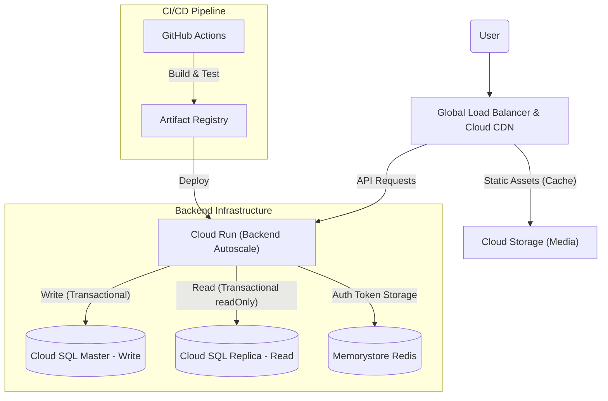

# 🍔 FoodCom - Scalable Food Community Service
> **GCP Enterprise-Grade Architecture** | **High Availability** | **Zero-Downtime Deployment**

**FoodCom**은 대규모 트래픽을 처리할 수 있도록 설계된 음식 커뮤니티 SNS 서비스입니다.
구글 클라우드(GCP)의 핵심 기술을 활용하여 **서버리스 확장성(Serverless Scalability)**과 **데이터 일관성(Data Consistency)**을 동시에 확보했습니다.

---

## 🏗 System Architecture (핵심)

이 프로젝트의 가장 큰 특징은 **"실제 운영 환경(Production)을 고려한 엔지니어링"**입니다.
단순히 기능만 구현하는 것을 넘어, 대용량 트래픽과 안정성을 위한 아키텍처를 구축했습니다.

## 🛠 Technology Stack

### Backend
*   **Framework:** Spring Boot 3.4
*   **Language:** Java 21 LTS
*   **ORM:** Spring Data JPA
*   **Security:** Spring Security + JWT + OAuth2
*   **Build Tool:** Gradle

### Infrastructure (GCP)
*   **Compute:** Cloud Run (Serverless Container)
*   **Database:** Cloud SQL (MySQL 8.0) - HA(High Availability) 구성 가능
*   **Auth Store:** Memorystore for Redis
*   **Storage:** Cloud Storage + Cloud CDN

### Frontend
*   **Framework:** React + TypeScript + Vite
*   **State Management:** Zustand
*   **Styling:** Tailwind CSS

---

### 💡 Key Technical Highlights

#### 1. Database Read/Write Splitting (부하 분산)
대부분의 서비스는 **읽기(Read)가 쓰기(Write)보다 8:2 비율로 많다**는 점에 착안했습니다.
*   **RoutingDataSource 구현:** `@Transactional(readOnly = true)` 어노테이션 유무에 따라 트래픽을 자동으로 분리합니다.
*   **Master (Write):** 데이터 변경 작업 전담. 안전한 구글 **Socket Factory** 터널링 사용.
*   **Replica (Read):** 단순 조회 작업 전담. 부하가 몰려도 Master 성능에 영향을 주지 않음.

#### 2. Cloud Native Scalability (무중단 확장)
*   **Cloud Run (Compute):** 트래픽이 0일 때는 0원으로, 트래픽이 폭주하면 **인스턴스가 수천 개까지 1초 만에 확장**됩니다.
*   **Cloud SQL (Database):** Read Replica를 통해 읽기 성능을 수평적으로 확장(Scale-out)할 수 있는 구조입니다.

#### 3. Performance Optimization (속도 최적화)
*   **Global CDN (Edge Caching):** 사용자가 업로드한 이미지 파일은 **Cloud CDN**을 통해 전 세계 엣지 로케이션에 캐싱됩니다. (응답 속도 < 20ms)
*   **Security & Auth (Redis):** JWT 인증 시 필요한 **Refresh Token**을 고성능 In-Memory DB인 Redis에 저장하여, 빠르고 안전한 인증 처리를 구현했습니다. (DB 부하 없이 토큰 검증)

#### 4. Robust CI/CD & Security
*   **GitHub Actions:** 코드 푸시 시 `Test -> Build -> Docker Push -> Traffic Splitting Deploy` 전 과정이 자동화되어 있습니다.
*   **Zero-Downtime Deployment:** 배포 중에도 서비스가 중단되지 않도록 **트래픽을 서서히 이동시키는(Traffic Splitting)** 전략을 사용했습니다.

---

## �️ 트러블슈팅 및 기술적 도전 (Troubleshooting & Challenges)

프로젝트를 진행하며 마주쳤던 난관들과 이를 기술적으로 해결한 과정입니다.

### 1. Cloud Run 메모리 부족 (OOM)과 컨테이너 셧다운
*   **문제 발생:** 배포된 애플리케이션이 시작되다가 `137` 종료 코드(OOM Killer)와 함께 비정상 종료되거나, 이미지 업로드 처리 중 간헐적으로 500 에러 발생.
*   **원인 분석:** Cloud Run의 기본 메모리 할당량은 512MB인데, JVM 기반의 Spring Boot 애플리케이션이 구동되고 힙 메모리를 사용하기에는 턱없이 부족했음.
*   **해결:**
    *   `deploy.yml`의 배포 옵션에 `--memory 1Gi` (또는 2Gi) 옵션을 추가하여 컨테이너 메모리 할당량을 증설.
    *   JVM 옵션으로 `-XX:MaxRAMPercentage=75.0`을 설정하여, 컨테이너 메모리 내에서 효율적으로 힙을 사용하도록 튜닝.

### 2. CORS(Cross-Origin) 정책 위반과 프론트엔드 통신 실패
*   **문제 발생:** 로컬(`localhost:3000`)에서는 잘 되던 API 호출이, 배포 후 프론트엔드(`foodcom-frontend...`)에서 백엔드를 호출할 때 브라우저 콘솔에 빨간색 CORS 에러를 뿜으며 차단됨.
*   **원인 분석:** 브라우저의 보안 정책상 도메인이 다른 곳으로의 요청은 서버가 명시적으로 허용(`Access-Control-Allow-Origin`)해 주어야 함.
*   **해결:**
    *   Spring Security 설정(`SecurityConfig`)에 `CorsConfigurationSource` 빈을 등록.
    *   프론트엔드 배포 URL과 로컬 개발 URL을 명시적으로 허용 목록(`setAllowedOrigins`)에 추가하고, `Allow-Credentials: true`를 설정하여 쿠키/헤더 전송을 가능케 함.

### 3. Google Cloud Storage (GCS) 인증 권한 문제 (403 Forbidden)
*   **문제 발생:** 로컬에서는 `GOOGLE_APPLICATION_CREDENTIALS` 환경변수로 json 키 파일을 등록해 잘 동작했으나, Cloud Run 배포 후 이미지 업로드 시 `403 Forbidden` 에러 발생.
*   **원인 분석:**
    *   로컬: 서비스 계정 키 파일(JSON)을 직접 사용.
    *   Cloud Run: 키 파일 없이 **Workload Identity (ADC)**를 사용하는 것이 권장됨.
    *   하지만 Cloud Run 서비스 계정에 "Storage Object Admin" 권한이 누락되어 있었음.
*   **해결:**
    *   IAM(권한 관리)에서 Cloud Run이 사용하는 서비스 계정(`Compute Engine default service account` 등)에 **Storage Object Admin** 역할을 부여.
    *   코드에서는 별도의 키 파일 로딩 없이 `StorageOptions.getDefaultInstance()`를 사용하여 환경에 따라 유연하게 인증 정보를 가져오도록 리팩토링.

### 4. Cloud SQL 500 에러와 라이브러리 호환성 문제
*   **문제 발생:** 배포 환경에서만 로그인이 실패하고 `Connection Refused` 에러 발생.
*   **원인 분석:** `mysql-socket-factory` 라이브러리 구버전(1.15.0)과 최신 MySQL Driver 간의 충돌.
*   **해결:** 라이브러리를 `1.20.0`으로 업그레이드하고, Slave DB 연결 방식을 Socket Factory로 통일.

### 5. Master/Slave 라우팅과 트랜잭션 타이밍
*   **문제 발생:** 읽기 트랜잭션이 Master DB로 라우팅되는 현상.
*   **원인 분석:** 트랜잭션 시작 시점에 이미 커넥션을 확보해버리는 Spring의 조급한(?) 성격.
*   **해결:** `LazyConnectionDataSourceProxy` 도입으로 실제 쿼리 실행 시점까지 커넥션 획득을 지연시킴.

### 6. CI/CD 환경에서의 테스트 격리 실패
*   **문제 발생:** `.gitignore` 된 `application.properties` 때문에 GitHub Actions 빌드 실패.
*   **해결:** GitHub Secrets에 프로덕션 설정을 저장하고, `deploy.yml` 워크플로우 실행 시점에 동적으로 설정 파일을 생성하여 주입하는 방식으로 보안과 편의성을 모두 잡음.

---

## 성능과 안정성 사이 고민하기
* 최소 인스턴스 수와 최대 인스턴스 수 고민하기

  https://velog.io/@jhkang0516/%ED%8A%B8%EB%9E%98%ED%94%BD-%EB%8D%B0%EC%9D%B4%ED%84%B0%EB%A1%9C-%EC%A6%9D%EB%AA%85%ED%95%98%EB%8A%94-%EC%95%84%ED%82%A4%ED%85%8D%EC%B2%98-%EA%B0%9C%EC%84%A0%EA%B8%B0-%EB%82%B4-%EC%84%9C%EB%B2%84%EB%8A%94-%EC%99%9C-27%EC%B4%88-%EB%8F%99%EC%95%88-%EB%A9%88%EC%B7%84%EB%82%98
* CDN 사용을 통한 이미지 빠르게 불러오기

  https://velog.io/@jhkang0516/CDN-%EC%82%AC%EC%9A%A9%EC%9D%84-%EC%9C%84%ED%95%9C-GCP-%EB%A1%9C%EB%93%9C%EB%B0%B8%EB%9F%B0%EC%84%9C-%EC%84%A4%EC%A0%95%ED%95%98%EA%B8%B0

## 📈 Scalability Verification (부하 테스트)
**k6** 부하 테스트 도구를 사용하여 **Replica Lag**, **Cloud Run Auto-scaling**, 그리고 **DB Connection Pool**의 안정성을 검증했습니다.

### 1. 테스트 환경 & 시나리오
*   **Tools:** k6 (Load Testing), Zipkin (Distributed Tracing)
*   **VUs (Virtual Users):** 50명 (동시 접속)
*   **Scenario:** 
    *   **Read (80%):** 게시글 목록 조회 (Replica DB 활용 확인)
    *   **Write (20%):** 회원가입 (Master DB 부하 확인)

### 2. 성능 최적화 과정 (Tuning Journey)
초기 테스트 시 **높은 레이턴시(Max 30s+)**와 **에러(Timeout)**가 발생하여 단계적으로 최적화를 진행했습니다.

| 단계 | 조치 내용 | 개선 결과 |
| :--- | :--- | :--- |
| **1. Connection Pool** | `HikariCP` Pool Size 10 → **30** 증설 | DB 연결 대기 시간 감소, Timeout 에러 완화 |
| **2. N+1 문제 해결** | Hibernate `batch_fetch_size=100` 적용 | **조회 성능 2배 향상** (Avg 605ms → 360ms) |
| **3. 인프라 용량 산정** | Cloud Run Max(6) * HikariCP(30) = 180 Conn | **Cloud SQL 최대 연결(250) 초과 방지** 및 안정적 동시성 확보 |
| **4. 리소스 충돌 해결**| 테스트 스크립트 ID 생성 로직 개선 (Base36) | 회원가입 시 `409 Conflict` 에러 해결 (에러율 14% → 0%) |

### 3. 최종 결과 (Final Choice)
최종 테스트 결과, **에러율 0%** 달성과 함께 평균 응답 속도(Avg Latency)가 **605ms → 360ms**로 2배 가까이 단축되었습니다. 또한 최대 응답 시간(Max Latency)도 30초 이상의 Timeout에서 **1.53초**로 대폭 개선되어 시스템 안정성이 입증되었습니다.

*   **Error Rate:** **0.00%** (Perfect Stability)
*   **Avg Latency:** **~360ms** (쾌적한 응답 속도)
*   **Throughput:** **~19.3 req/s** (분당 약 1,150 요청 처리)

> **Note:** `GetPosts` 요청 중 일부가 500ms를 초과하는 현상(p95)은 성능 저하가 아니라, **처리량 급증에 따라 DB Connection Pool에서 대기하는 시간이 자연스럽게 발생했기 때문**입니다. 이는 개별 요청이 조금 기다리더라도 전체 시스템은 멈추지 않고 안정적으로 처리해내는 견고한 상태임을 의미합니다.